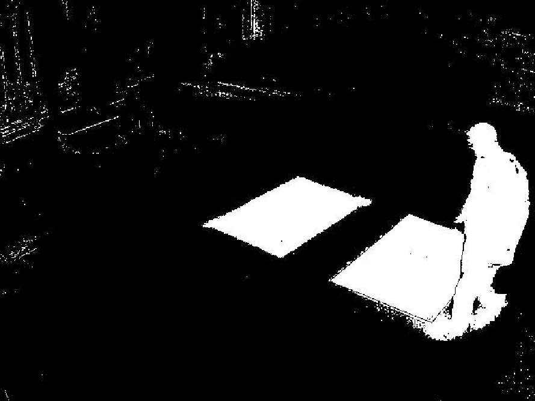

# cctv_rasp

## How to setup
if you use the camera module for raspberry pi, execute ```./cam_setup.sh```

```
pip install -r requirement.txt
cd cctv && python cctv.py
```

## Smart recording
By object recognition, it records videos only when the object is detected. For
the object detection, the background subtraction algorithm is used. The recorded
videos are stored in the directory named 'video'.


